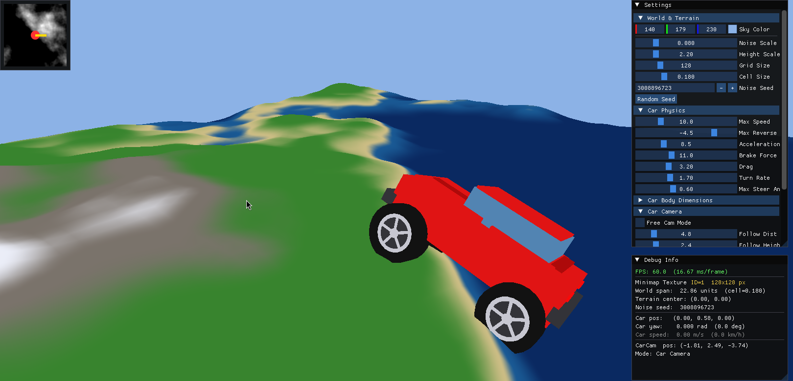

<!--  -->

# CarMap



## submodule

```bash
git submodule update --init --recursive
```

## build (for linux)

```bash
cd CarMap
mkdir build
cd build
cmake ..
make -j$(nproc)
```

## build (for windows)

```bash
cd CarMap
mkdir build
cd build
cmake ..
cmake --build . --config Release
```

### run (for linux)

```bash
./GrafikaLabor
```

### run (for windows)

```bash
GrafikaLabor.exe
```
